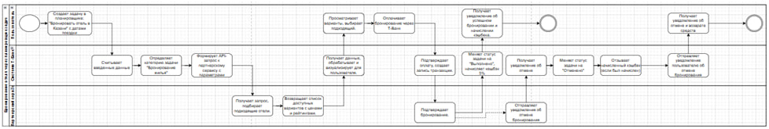
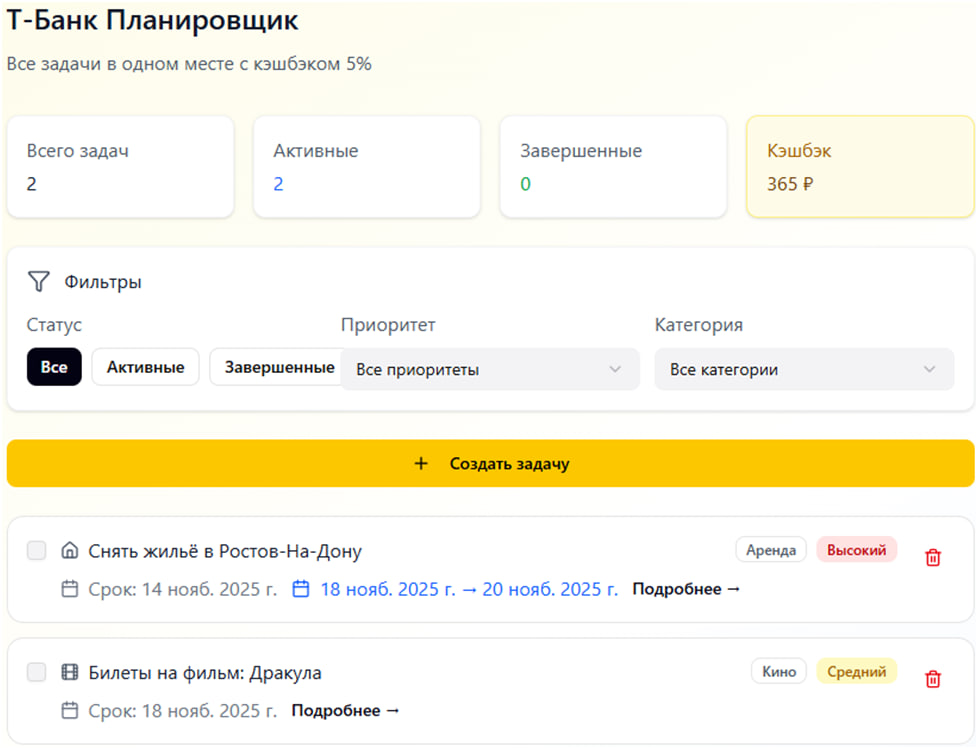
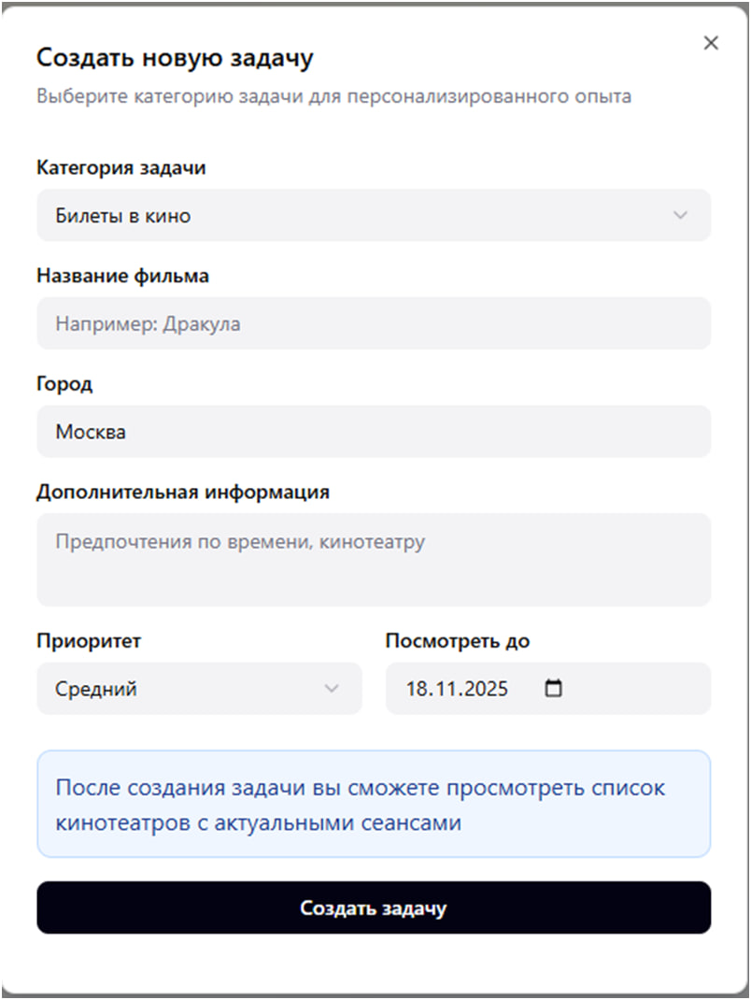
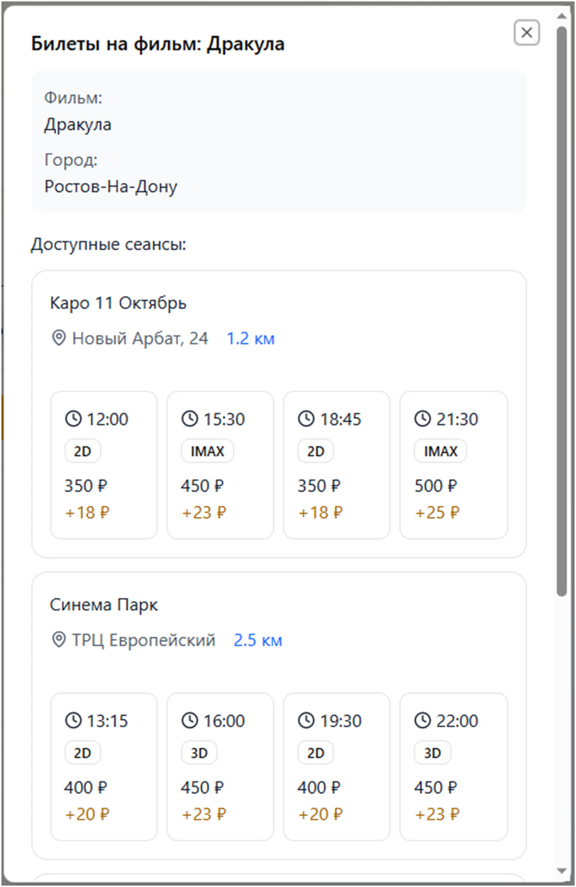

# 🏦 T-Bank Task Planner — концепт новой функции экосистемы Т-Банк

## 📌 Описание проекта
Разработка концепта и проектной документации для новой функции «Планировщик задач» в мобильном приложении Т-Банк.

Цель проекта — позволить пользователям планировать бытовые и деловые задачи (доставка, бронирование, билеты, топливо) прямо внутри экосистемы банка, получая кэшбэк и оставаясь в одном приложении.

---
## 💡 Цель кейса
Продемонстрировать подход к системному анализу и проектированию новой функции экосистемного продукта: от сбора требований до визуализации бизнес-процессов и интерфейсов.
---
## 🎯 Цели и метрики
- Повышение вовлеченности пользователей: 30% активных пользователей создают хотя бы одну задачу за неделю.  
- 70% пользователей совершают хотя бы один заказ через планировщик.  
- Увеличение среднего числа сессий на 10% после запуска функции.  
- DAU (Daily Active Users) ≥ 1000.

---

## 👤 Типичные пользователи
- **Марина (29 лет)** — активный пользователь, делает покупки и бронирования.  
- **Илья (35 лет)** — бизнес-пользователь, бронирует жильё, рестораны и заправки.  
- **Максим (26 лет)** — активный путешественник, использует бронирование и топливо в поездках.

---

## 📖 Основные User Stories
- Создание задачи с покупкой билетов, еды, бронированием жилья.  
- Интеграция с партнёрскими сервисами (Click.ru, Кинопоиск API, Ozon Travel).  
- Автоматическое начисление кэшбэка 5% через Т-Банк.  
- Изменение статусов задач: `Создана → В процессе → Выполнена / Отменена`.

---

## ⚙️ Нефункциональные требования
- Время отклика ≤ 1 сек.
- Доступность 99.9% (включая офлайн-режим).
- Интеграции через REST API.
- TLS 1.3 и защита персональных данных.
- Масштабируемость архитектуры.

---

## 🧩 Диаграммы и прототипы
Схемы и визуальные материалы находятся в папке:

- **Бизнес-процесс (BPMN)**
> Диаграмма отражает взаимодействие пользователя, системы и внешних сервисов при бронировании отеля через планировщик задач.

- **Схема переходов статусов задач**
> Отражает жизненный цикл задачи — от создания до выполнения или отмены.

- **Прототип интерфейса** (главный экран, фильтрация, выбор вариантов)

---
## 📱 Интерфейс планировщика задач

Ниже представлены примеры экранов из прототипа веб-версии приложения T-Банк Планировщик задач:

---
## 🛠️ Используемые инструменты
`Draw.io`, `Figma`, `Excel`, `Confluence`, `REST API`, `BPMN 2.0`

---

## 📈 План релизов
**MVP:**  
- Создание, редактирование и удаление задач.  
- Интеграция с 1–2 партнёрскими сервисами.  
- Начисление кэшбэка.

**V2:**  
- Уведомления, избранные задачи, расширенные категории.  

**V3:**  
- Голосовое управление, AI-подсказки, аналитика по пользователю.

---
## 📘 Мой вклад
- Анализ требований и формализация User Story (9 сценариев)
- Построение BPMN-диаграмм и модели статусов задач
- Подготовка SRS-документации
- Проработка нефункциональных требований
- Формирование пользовательских персонажей
---
## 👨‍💻 Автор
**Максим Зарубин** — системный аналитик  
📞 8-989-611-44-05  
💬 [@Pangg_ml](https://t.me/Pangg_ml)
